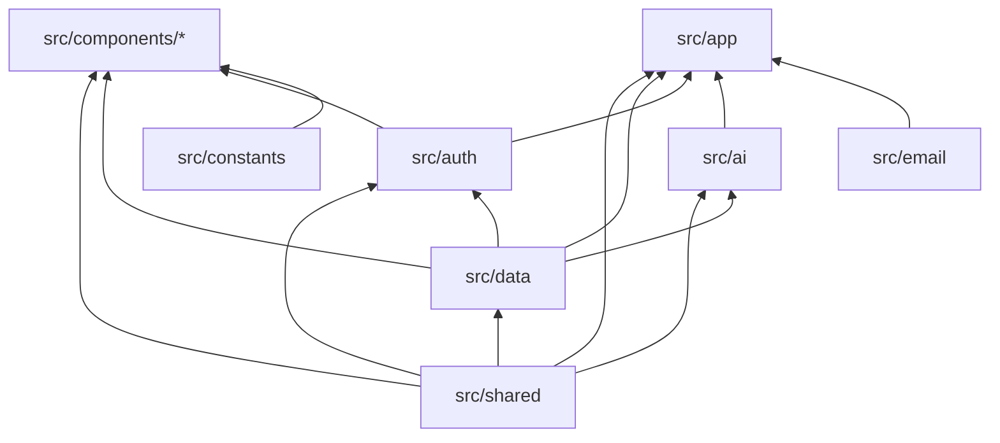

# HealthAssist — Architecture Guide

## 1. Project Overview

HealthAssist is an AI-powered healthcare management platform connecting patients and doctors on a single unified interface.

| Layer | Technology |
|---|---|
| **Framework** | Next.js 14 (App Router) |
| **Database & Auth** | Supabase (PostgreSQL + Auth + RLS) |
| **Styling** | TailwindCSS + Radix UI (shadcn/ui pattern) |
| **AI** | Sarvam AI (chat completions + multilingual translation) |
| **Email** | Nodemailer (Gmail SMTP) |
| **Deployment** | Vercel |

---

## 2. Module Map

The `src/` directory is organized into **layered modules** with strict dependency rules. Each module owns a single concern and must never reach into another module's internals.

### `src/shared` — Foundation Layer

| | |
|---|---|
| **Owns** | `utils.ts` (`cn()` Tailwind class-merge helper), `types.ts` (all shared TypeScript interfaces: `Doctor`, `Patient`, `UserProfile`, `MedicalRecord`, `Appointment`, `DoctorProfile`, `AvailabilitySlot`) |
| **Must never touch** | Business logic, Supabase calls, API routes, React components |
| **Imported by** | Every module in the project |
| **Depends on** | External libs only (`clsx`, `tailwind-merge`) |

### `src/auth` — Authentication & Authorization

| | |
|---|---|
| **Owns** | `AuthContext.tsx` (React context provider + `useAuth` hook), `AuthGuard.tsx` (route protection component), `useRole.ts` (role-checking hook), `UserRole` type |
| **Must never touch** | Medical records, appointments, AI, email, UI primitives |
| **Imported by** | Dashboard layouts, all protected pages, layout components |
| **Depends on** | `src/shared` (for `UserProfile` type), `src/data` (for Supabase client) |

### `src/data` — Data Access Layer

| | |
|---|---|
| **Owns** | `supabase.ts` (browser client via `createBrowserClient`), `supabaseAdmin.ts` (server-side client with service role key), `seed/dummyData.ts` (test data seeding), `actions/seedVitals.ts` (vitals seeding server action) |
| **Must never touch** | UI rendering, component logic, AI prompts |
| **Imported by** | `src/auth`, `src/ai`, most pages/components that fetch data |
| **Depends on** | `src/shared` (for types) |

### `src/ai` — Sarvam AI Integration

| | |
|---|---|
| **Owns** | `sarvam.ts` (Sarvam AI client + `analyzeMedicalText()`), `constants.ts` (language code map for 23 Indian languages), `context.ts` (medical records context assembly for AI prompts), `actions/analyze.ts`, `actions/translate.ts`, `actions/healthScore.ts` (server actions) |
| **Must never touch** | Auth, email, UI components, Supabase client initialization |
| **Imported by** | `src/app/actions.ts` (barrel re-export), `HealthInsightPanel`, `AIChatInterface` |
| **Depends on** | `src/data` (for `supabaseAdmin`), Sarvam AI SDK |

### `src/email` — Email Notifications

| | |
|---|---|
| **Owns** | `transport.ts` (Nodemailer transporter setup + `sendEmailAction`), `templates.ts` (all HTML email templates — appointment, message, record, verification notifications) |
| **Must never touch** | Auth, AI, UI, database schema |
| **Imported by** | API routes (`/api/send-email`, `/api/admin/verify-doctor`) |
| **Depends on** | External libs only (`nodemailer`) |

### `src/constants` — Domain Constants

| | |
|---|---|
| **Owns** | `doctorOnboarding.ts` (speciality categories, medical councils, degrees, languages, onboarding steps), `medicalTests.ts` (test categories, parameters, normal ranges) |
| **Must never touch** | Runtime logic, API calls, UI rendering |
| **Imported by** | `UploadRecordForm`, doctor onboarding page |
| **Depends on** | Nothing (pure data) |

### `src/components/ui` — Design System (shadcn/ui)

| | |
|---|---|
| **Owns** | 19 atomic UI primitives (`button`, `input`, `dialog`, `select`, `card`, `avatar`, `GlassCard`, `LoadingSpinner`, `PremiumFeatureCard`, etc.), `theme-provider.tsx`, `theme-toggle.tsx` |
| **Must never touch** | Business logic, data fetching, auth, AI |
| **Depends on** | `src/shared` (for `cn()` utility), Radix UI primitives |

### `src/components/patient` — Patient Feature Components

| | |
|---|---|
| **Owns** | `BookAppointmentModal`, `DoctorCard`, `HealthInsightPanel`, `RecordCard`, `Timeline`, `VitalsChart`, `dashboard/HeroSection`, `dashboard/MedicalTimeline`, `dashboard/StatsWidget`, `records/RecordParams` |
| **Must never touch** | Doctor-specific features, admin logic |
| **Depends on** | `src/shared`, `src/data`, `src/auth`, `src/components/ui`, `src/ai` (via server actions) |

### `src/components/doctor` — Doctor Feature Components

| | |
|---|---|
| **Owns** | `AINoteAssistant`, `AppointmentRequests`, `PatientHistory`, `PatientList`, `PatientSummary` |
| **Must never touch** | Patient-specific features, admin logic |
| **Depends on** | `src/shared`, `src/data`, `src/auth`, `src/components/ui` |

### `src/components/layout` — App Shell

| | |
|---|---|
| **Owns** | `Header.tsx`, `Sidebar.tsx`, `NotificationDropdown.tsx` |
| **Must never touch** | Page-specific business logic |
| **Depends on** | `src/shared`, `src/auth`, `src/data`, `src/components/ui` |

### `src/components/records` — Medical Records Components

| | |
|---|---|
| **Owns** | `UploadRecordForm`, `UploadRecordModal`, `RecordDetailsDialog` |
| **Must never touch** | Auth, AI logic, email |
| **Depends on** | `src/shared`, `src/data`, `src/auth`, `src/constants`, `src/components/ui` |

### `src/components/chat` — AI Chat Interface

| | |
|---|---|
| **Owns** | `AIChatInterface.tsx` |
| **Must never touch** | AI internals (consumes via server actions only) |
| **Depends on** | `src/shared`, `src/auth`, `src/components/ui` |

### `src/app` — Next.js Routes (App Router)

| | |
|---|---|
| **Owns** | All page routes (`/`, `/login`, `/onboarding`, `/dashboard/**`, `/admin/**`), API routes (`/api/send-email`, `/api/admin/verify-doctor`), `actions.ts` (barrel re-export of server actions), `layout.tsx`, `globals.css` |
| **Rule** | Route files stay here (Next.js filesystem convention). They import from modules but never contain reusable logic themselves. |

---

## 3. Dependency Chain

```
  ┌──────────────┐
  │  src/shared   │  ← Foundation (pure utilities + types)
  │  src/constants│  ← Pure data (no imports)
  └──────┬───────┘
         │
  ┌──────▼───────┐
  │   src/data    │  ← Data access (Supabase clients)
  └──────┬───────┘
         │
  ┌──────▼───────┐    ┌──────────────┐
  │   src/auth    │    │  src/email   │  ← Email (nodemailer, no app deps)
  └──────┬───────┘    └──────────────┘
         │
  ┌──────▼───────┐
  │    src/ai     │  ← AI (Sarvam client + server actions)
  └──────┬───────┘
         │
  ┌──────▼────────────────────────────┐
  │  src/components/* (UI + features) │
  └──────┬────────────────────────────┘
         │
  ┌──────▼───────┐
  │   src/app     │  ← Next.js routes (top of the stack)
  └──────────────┘
```

**Rule:** Arrows point upward only. A module may import from any module above it in the chain, but **never** from a module below it.



---

## 4. Key Architectural Decisions

### Browser vs Server Supabase Client

| Client | File | Use Case |
|---|---|---|
| **Browser client** (`createBrowserClient`) | `src/data/supabase.ts` | Client components — auth state, real-time subscriptions, RLS-scoped queries |
| **Server client** (`createClient` with service role key) | `src/data/supabaseAdmin.ts` | Server actions & API routes — bypasses RLS for admin operations (fetching any user's records, verifying doctors, seeding data) |

Never use `supabaseAdmin` in client components. Never use the browser client in server actions that need cross-user data.

### Server Actions Pattern

All server actions live in their own module (`src/ai/actions/*`, `src/data/actions/*`) and are re-exported through `src/app/actions.ts` as a barrel file. This gives components a single import point while keeping the actual logic modular:

```ts
// Component imports from the barrel
import { analyzeMedicalTextAction, seedVitalsAction } from '@/app/actions';

// Barrel re-exports from modules
export { analyzeMedicalTextAction } from '@/ai/actions/analyze';
export { seedVitalsAction } from '@/data/actions/seedVitals';
```

### Auth Flow

1. `AuthProvider` (root layout) → initializes Supabase session, fetches user profile
2. `AuthGuard` (dashboard layout) → redirects unauthenticated/wrong-role users
3. `useAuth()` / `useRole()` → consumed by components needing user state

### Email Architecture

API routes (`/api/send-email`) handle all outbound email. They create their own Supabase admin client to look up user emails by ID, then use Nodemailer templates from `src/email/templates.ts`. Email templates are pure functions returning HTML strings — no React, no database calls.

---

## 5. Database Schema

See [CURRENT_DATABASE_STATUS.md](./CURRENT_DATABASE_STATUS.md) for the full Supabase table schema (7 tables: `profiles`, `appointments`, `conversations`, `messages`, `medical_records`, `health_metrics`, `timeline_events`).
